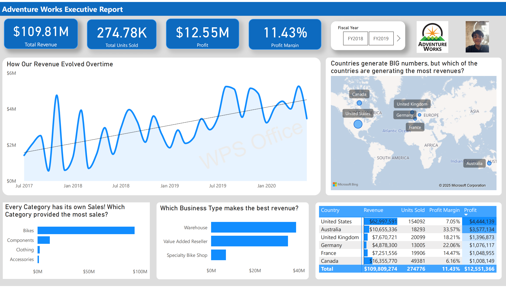

# 📊 Power BI End-to-End Sales Dashboard (Workshop Project)

This project is a refined and enhanced version of the Microsoft Power BI tutorial:  
**"Tutorial: From Dimensional Model to Stunning Report in Power BI Desktop"**, recreated and taught by **Mr. Abraham Avila Jr.**, Founder/CEO of [DataSense Analytics](https://datasenseph.com), during a free live masterclass session.

The project uses the **Adventure Works Sales** dataset and demonstrates the full Power BI lifecycle—from data modeling to report creation—with practical insights, best practices, and visual storytelling.

Made by chatgpt with the appropriate prompt

---

## 🚀 Project Highlights

- 📂 **Dataset**: Adventure Works (Sales) – Excel format
- 🧠 **Tools/Concepts Used**:
  - Power Query Editor (for data cleaning, data type fixes)
  - Star Schema Modeling & Table Relationships
  - DAX (custom measures, calculated columns)
  - Visualizations (bar, line, pie, KPIs, cards, etc.)
  - Slicers & Filtering
  - Report wireframing (Z-pattern, F-pattern)
  - Data storytelling & dashboard layout strategies
  - Optimization and best practices (e.g., minimizing clutter, choosing right visuals)
  - Publishing to Power BI Service

---

## 📁 Files in This Repository

| File/Folder        | Description |
|--------------------|-------------|
| `SalesDashboard.pbix` | Power BI Desktop project file |
| `screenshots/` or `dashboard-preview.pdf` | Screenshots or PDF preview of the report |
| `notes.md` or `learnings.txt` | Personal notes and tips from the training |
| `sample_dataset.xlsx` | Excel version of the Adventure Works dataset |

---

## ✨ What I Learned

✅ Refreshed and applied core Power BI concepts:
- Building **star schema models** and managing **table relationships**
- Cleaning and shaping data properly in **Power Query**
- Writing efficient and meaningful **DAX measures and columns**
- Understanding **dashboard layout rules** like:
  - Z-pattern and F-pattern design
  - Choosing **simple, direct, and insightful visuals**
  - Making dashboards **interactive and user-friendly**
- Enhancing report readability with **tooltips, slicers, and smart visuals**
- Gained hands-on experience with real-world modeling and presentation tips

---

## 🎓 Acknowledgments

Special thanks to **Mr. Abraham Avila Jr.**, Founder and CEO of [DataSense Analytics](https://datasenseph.com), for conducting this free training and sharing his knowledge and expertise.  
His practical approach and tips made the Microsoft tutorial more intuitive and engaging.

---

## 🎯 Purpose

This repo serves as:
- 🧾 A **record of learning and progress** in Power BI
- 🔍 A **proof of participation** in the masterclass
- 💡 A resource for other learners to get inspired or start their own dashboards

---

## 🛠️ Enhancements

- Minor improvements were made to visuals to enhance storytelling.
- The project has been uploaded and published on **Power BI Service** for sharing and access.

---

## 🖼️ Preview

> 
